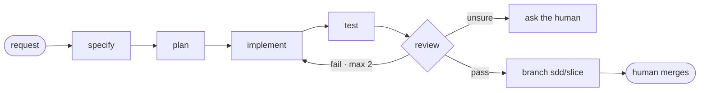

# Software Development Agent Framework

Give one request. Get back a finished, reviewed feature on a branch that only you can merge.
Works on any codebase, any language. Every change is linked to a rule, tested, and easy to undo.

It is a spec-driven, multi-agent setup for **GitHub Copilot**, **Claude Code**, and **Codex**
(preview), built on [spec-kit](https://github.com/github/spec-kit). Your code stays where it is.
The framework holds the process and the shared knowledge.

```bash
/dev.target register path/to/my-app
/dev.feature my-app "Add cursor pagination to the orders endpoint"
# → spec → plan → tasks → implement → tests → review → branch sdd/<slice>
#   You approve the steps and do the merge. The framework does the rest.
```

> **v0.1, experimental.** For an honest look at what is enforced vs. only instructed,
> read **[STATUS.md](STATUS.md)**.

> Ask for auth, payments, or personal-data work and the framework marks it CRITICAL.
> Then you lead and the agents only help. This limit is on purpose.

## What it gives you

- **Agents act on their own — but only within limits.** They go ahead when confident and
  ask you when not. A separate reviewer re-checks every change against the source rules
  before it is called done. (Both sides are the same kind of model, so this is a strong
  check, not a second human. Your merge is the final check.)
- **Knowledge is saved and reused.** Your standards, code examples, and past decisions live
  in a shared wiki. Later work starts from what earlier work learned.
- **No setup needed.** Just markdown files and a few scripts. No servers, no build step.
  Clone it and the Copilot / Claude Code / Codex files load on their own.
- **Light on context.** About 50 lines load every turn. Everything else loads only when used.

## For teams

A better model makes each agent better. It does not fix consistency, audit trails, or trust
across a team. This framework does. It turns one request into a change that is reviewed,
recorded, and easy to undo:



| Problem on a team | How it helps | Proof |
|-------------------|--------------|-------|
| Agents write code differently each time | Your rules + an independent review step | 20-rule check in the test run |
| No record of why code changed | Each change links spec → task → rule → result, all saved | [`docs/validation-runs/`](docs/validation-runs/) |
| Agents could break things | Hooks block risky writes and merges; only humans merge | hook tests + CI |
| Lessons get forgotten | A shared wiki keeps rules, examples, and decisions | growing example library |

### Does the review step catch real bugs? A side-by-side test says yes.

We built the same 3 tasks two ways: plain (one quick pass) and through the framework. Same
model both times. Each plain version passed its own tests and looked done. The review step
then caught a real bug in all 3 — and two were serious:

| Task | Plain version (tests passed) | What the review caught |
|------|------------------------------|------------------------|
| Compare versions | exit 0 | `1.0.0-rc.1` treated as **newer** than `1.0.0` (+ 3 more) |
| Split money | exit 0 | `$10 ÷ 3` → parts add up to **$9.99**, not $10 |
| Pagination | exit 0 | `page = -1` quietly returns **wrong rows**, no error |

Honest limit: these tasks all had tricky edge cases, which is why the check helped. On a
simple task done right, it catches nothing. → [full test](docs/validation-runs/2026-06-13-ab-suite.md)

### Will it save tokens?

Per task, no — it costs more, because it runs more steps. Over time, it can pay off. Think
of it as **insurance**: you pay a little extra on every task, and you get it back on the
tasks where it catches a bug that would cost a lot to find and fix later. So it is usually
worth it for important code, and not worth it for throwaway code. For small changes, use
`--micro` or just plain Copilot.

## Get started

```bash
git clone <repo-url> && cd software-dev-agent-framework
# open in VS Code (Copilot) or run `claude` (Claude Code), then:
/speckit.constitution && /dev.ingest-standards && /dev.ingest-exemplars
```

**[→ User Guide](docs/README.md)** · [Commands](COMMANDS.md) · [Architecture](ARCHITECTURE.md) ·
[Contributing](CONTRIBUTING.md) · [Constitution](.specify/memory/constitution.md)

## Layout

| Folder | What is inside |
|--------|----------------|
| `.specify/` | The engine — constitution, command guides, templates, workflows |
| `.github/` · `.claude/` | Copilot and Claude Code files + hooks (CI lives in `.github/`) |
| `standards/` · `exemplars/` | Your rules + example code — read-only inputs you write |
| `wiki/` | Knowledge the agents keep + a log of everything they do |
| `specs/` · `work-queue/` · `review-reports/` | Per-task files and status |
| `targets/` | The list of outside projects the agents work on |
| `tools/dashboard/` | VS Code extension — a live view of everything |
| `docs/` | The user guide |

MIT — see [LICENSE](LICENSE). The standards and examples that ship are starter files; replace them with your own.
